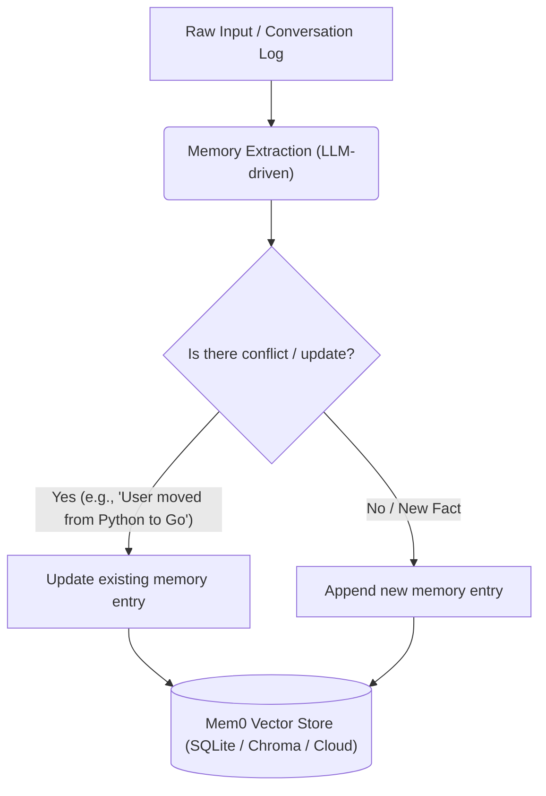

# Deep Dive: Mem0 — The Memory Layer for AI Agents

In the evolution of AI agents, moving beyond stateless, transactional interactions is a major milestone. Traditional Retrieval-Augmented Generation (RAG) provides agents with static reference material, but fails to allow agents to learn, adapt, and remember context across multiple distinct runs or user interactions. 

**Mem0** solves this challenge by acting as a persistent, self-evolving memory layer for AI agents. This document explores Mem0's architecture, key use cases, significance to the AI developer community, and its specific application in our **Autonomous SRE Agent** project.

---

## 1. What is Mem0?

Mem0 is a specialized memory management library designed for Large Language Models (LLMs) and autonomous agents. Unlike typical vector databases that store raw document chunks, Mem0 manages **entities, facts, preferences, and operational histories** dynamically.

### Mem0 vs. Traditional RAG

| Feature | Traditional RAG | Mem0 Memory Layer |
| :--- | :--- | :--- |
| **Data Nature** | Static documents (PDFs, Wikis, Markdown files). | Dynamic, user-centric/session-centric facts. |
| **Write operations** | Batch updates or periodic database re-indexing. | Real-time additions and automated self-updates. |
| **Context Window** | Stuffed with top-$K$ raw snippets (prone to noise). | Concisely distilled facts tailored to the entity/user. |
| **Statefulness** | Stateless. Each query is treated independently. | Stateful. Learns and updates context over time. |

---

## 2. Key Concepts of Mem0

Mem0 provides a structured memory layer based on three core concepts:



1. **User and Session Namespacing**: Memory is segmented by `user_id`, `session_id`, or `run_id`. This allows an SRE agent, for example, to keep general playbooks separate from session-specific investigations.
2. **Fact Extraction and Distillation**: When you add text to Mem0, it doesn't just store the string. It parses the content to extract core facts and stores them as distinct semantic units.
3. **Conflict Resolution & Memory Evolution**: If new information contradicts a past memory, Mem0 automatically updates or overwrites the old memory. For example:
   * *Memory 1*: "The payment-api connection pool is configured to 20."
   * *New Input*: "We updated the database pool size of payment-api to 50."
   * *Resulting Memory*: "The payment-api connection pool is configured to 50."

---

## 3. Significance in the AI Agent Developer Community

For developers building autonomous agents, Mem0 is a critical tool for solving several fundamental limitations of LLMs:

### 🚀 True Personalization & Continuity
AI assistants can remember user preferences, developer environments, coding patterns, and past bugs across days or weeks. This removes the need to re-explain context at the start of every session.

### 📉 Token Efficiency & Cost Reduction
Without a memory layer, developers must stuff the LLM context window with the entire chat history or large database dumps. Mem0 extracts only the relevant, distilled facts, saving thousands of tokens per prompt.

### 🔄 Continuous Learning Loop
Agents can log the outcome of their actions. If an agent tries to fix a bug using Approach A and fails, it logs that failure into Mem0. On the next attempt, it recalls that failure and chooses Approach B.

---

## 4. How Mem0 Powers the Autonomous SRE Agent

In this workshop repository, Mem0 acts as the agent's **experience engine**. Without it, the agent would be a blind script. Here is how it operates in the SRE workflow:

```text
               +-------------------------------------------------+
               |             Memory-to-Action Loop               |
               +-------------------------------------------------+
                                       |
  1. Learn Playbook                    | 2. Recall Playbook
  -----------------                    | ------------------
  SRE inserts resolution rules        | Alert triggers agent;
  into Mem0 memory.                    | Agent searches Mem0 for symptoms.
                                       |
                                       v
                               +---------------+
                               |  Mem0 Memory  |
                               +---------------+
                                       ^
                                       |
  4. Writeback / Learn                 | 3. Execute & Diagnoses
  --------------------                 | ----------------------
  Agent logs the result of the fix     | Gemini processes observations;
  back into Mem0 for future recall.    | Agent runs API/remediation fixes.
```

### Step 1: Learning Phase (Memory Insertion)
We teach the agent how to resolve issues. In [agent/main.py](file:///Users/jitendragupta/Desktop/memory_to_action_workshop/agent/main.py#L17-L21), we call the [SREMemory](file:///Users/jitendragupta/Desktop/memory_to_action_workshop/agent/memory.py) module to add operational context:
```python
memory.add("Incident: payment-api timeout. Cause: DB pool size too small. Solution: Reset via REST API.")
```

### Step 2: Observation & Retrieval (Semantic Recall)
When a database pool outage is injected, the agent receives an alert query (e.g., *"payment-api response latency > 5s"*). The agent queries Mem0:
```python
past_incidents = memory.search("payment-api latency high")
```
Even though the phrasing differs ("latency high" vs "timeout"), Mem0's vector search matches the semantics and retrieves the playbook.

### Step 3: Action & Remediation
The agent passes this recalled playbook along with the live Grafana panel screenshots (captured via [SREInvestigator](file:///Users/jitendragupta/Desktop/memory_to_action_workshop/agent/investigator.py)) to the Gemini model in [agent/planner.py](file:///Users/jitendragupta/Desktop/memory_to_action_workshop/agent/planner.py#L33-L76). Gemini executes the reset API call to solve the issue.

### Step 4: Storing Findings (Evolution)
Once the outage is resolved, the agent records the execution results back to Mem0:
```python
new_memory = "Incident Alert: payment-api latency high. Root Cause: DB Pool Exhaustion. Action: Successfully resolved via API reset."
memory.add(new_memory)
```
The agent has now learned from its own successful action, enriching its memory for the next occurrence.

---

## 5. Architectural Implementation in this Repo

The repository implements a resilient multi-tier memory configuration in [agent/memory.py](file:///Users/jitendragupta/Desktop/memory_to_action_workshop/agent/memory.py):

1. **OpenClaw CLI Integration**: If the OpenClaw Mem0 plugin is detected (`openclaw mem0 status`), it runs CLI commands under the hood. This shares memory between your CLI agent runs and your OpenClaw natural language assistant.
2. **Mem0 Cloud Platform Client**: If `MEM0_API_KEY` is provided, it connects to the managed Mem0 cloud service for high-performance retrieval and conflict resolution.
3. **Local Vector Database**: If running locally, it spins up a local Chroma instance utilizing Gemini embedding models (`text-embedding-004`).
4. **JSON File Fallback**: If no LLM keys are present, it falls back to keyword-based searching on a local JSON file ([local_sre_memory.json](file:///Users/jitendragupta/Desktop/memory_to_action_workshop/local_sre_memory.json)) to ensure the codebase remains operational.

---

## 6. Summary

Mem0 transitions AI agent design from **reactive text completion** to **stateful, adaptive systems**. By pairing Mem0 (memory) with Gemini (reasoning) and Playwright/OpenClaw (observation and execution), developers can build agents that operate in complex, real-world environments like system operations (SRE) and continuously improve through experience.
